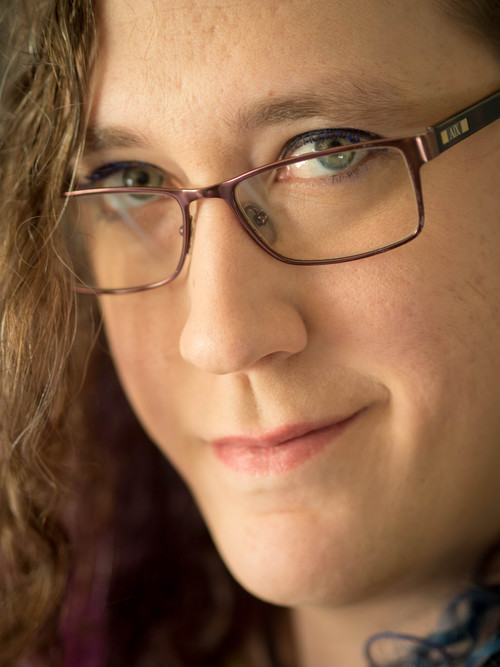

## Madison Jesse Scott-Clary

Madison Scott-Clary is a composer, programmer, and writer living in Loveland, CO. She studied music composition at Colorado State University under Dr. David Wohl, Dr. Forest Greenough, and Dr. James David. She counts among her influences John Adams, Arnold Schoenberg, Sergei Prokofiev, and Dmitri Shostakovich. Although her true love has always been choral music, she has sought to branch out as much as possible.

This [page](http://sounds.drab-makyo.com) and [repository]({{ site.github.repository_url }}) house recordings, sheet music, and other sounds, most of which are licensed free for use.

### [Compositions](compositions)

This includes sheet music and, if applicable, recordings of music intended to be performed by an individual or group.

* [Solo](compositions/solo) (including solo works with minimal accompaniment)
* [Small Ensemble](compositions/small-ensemble)
* [Large Ensemble](compositions/large-ensemble)

### [Electronic Music](electronic-music)

This includes recordings and, in some cases, the source files for electronic music not necessarily intended to be performed so much as distributed or remixed.

### [Miscellaneous Sounds](misc)

Exactly what it says on the tin
